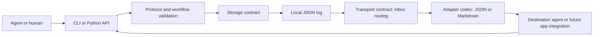

# Architecture

## Scope and boundaries

Agent Bridge exchanges structured project state. It owns validation, local
delivery, receipts and lifecycle rules. The consuming agent owns task execution;
the integration owns provider authorization and human input.



All runtime code uses the Python standard library. JSON Schema validation is a
development dependency used to verify interoperability. The runtime performs
strict envelope and payload checks plus workflow checks that JSON Schema cannot
express, such as matching a report to its current handoff.

## Protocol

Every envelope identifies a project, a message, a source and destination, a
correlation/task, a UTC timestamp, a kind, a status and a typed payload.
`extensions` accepts namespaced JSON values. Agent identifiers are ordinary
strings, allowing new providers without modifying the schema.

State, decisions, approval resolutions, tasks, handoffs, reports and
acknowledgments are separate immutable events. A result never silently completes
a task: the creator reviews and acknowledges a successful report. Approval is
explicitly linked to task dispatch. A task without attached approval decisions
does not require an approval record.

## Storage

One `FileSystemStore` instance points at a project root:

```text
.agentbridge/
  config.json
  .lock                          # present only during a transaction
  messages/
    000000000001_<message-id>.json
    000000000002_<message-id>.json
```

The numeric filename establishes **local ingestion order**; remote timestamps
never determine replay order. The envelope remains portable and does not contain
transport-specific sequence metadata. Replies require their parent to have
already been ingested.

Reads and writes acquire an exclusive lock file with a bounded timeout. Mutation
validates the full existing log, checks the new transition, then publishes one
file using a temporary file, file fsync and atomic replacement. A failed
unpublished write cannot partially update a task or its inbox: both are views
of the same log. Invalid JSON, missing sequence numbers, incorrect IDs and
invalid lifecycle transitions fail closed. No automatic repair discards data.

A process crash may leave a lock or an unpublished `.pending-*` file. The latter
is ignored; stale-lock recovery requires an operator to confirm no writer is
active. See SECURITY.md. Atomic file publication does not guarantee durability
across every filesystem or power failure; the directory itself is not fsynced.
Network shares and hostile concurrent filesystem modification are outside the
supported trust boundary.

Projection is O(n) in the number of messages per operation; the log is optimized
for correctness and small v0.1 projects. No database, index, separate queue or
daemon is required. A future storage implementation can provide transactions
without changing protocol envelopes. Each Store instance is used sequentially;
concurrent callers use separate instances/processes.

## Transport

`LocalTransport.inbox()` selects messages with the requested destination and,
unless `--all` is used, excludes messages with a recorded receipt. Reading is
non-destructive. Identical message replay and repeated acknowledgment are
idempotent. This supports at-least-once delivery; integrations must not execute
work twice merely because an unacknowledged message is delivered again.

The inbox includes receipt notifications, which are informational and cannot be
acknowledged recursively. Completion and approval are governed by workflow
rules, not inbox removal.

GitTransport now carries canonical envelopes through an explicit mailbox branch.
Future HTTP or MCP transports can use the same boundary. Authentication,
idempotency, causality and synchronization remain explicit integration concerns.
Copying individual JSON files into the local log is unsupported; use `receive`
or `import` so that validation and local ordering remain intact.

## Adapters and execution

Adapters encode/decode canonical JSON and render Markdown packets. The Codex
reference adapter adds a coding-agent workflow; the ChatGPT adapter describes
the structured integration boundary. Neither adapter launches an agent, reads a
conversation or executes payload instructions.

Handoff context defaults to the latest structured project state, the current
decision projection and the target task. `--context FILE` can supply a smaller
explicit context object. Full conversation history and arbitrary project file
contents are never collected automatically. Artifact references remain inert.

Hermes, MindOS and other runners can implement the same adapter contract and use
their own namespace in `extensions`; provider-specific configuration and secrets
belong outside the protocol log.

## Decisions made for v0.1

- Python 3.11+ and argparse: a portable CLI with no runtime dependencies.
- JSON only as the canonical format: one parser and one schema; Markdown views
  support manual workflows without synchronizing two mutable formats.
- Immutable local events: reproducible state and one atomic mutation per action.
- Explicit project IDs and reply/task links: reject accidental cross-project or
  stale results.
- Claimed identities and local file access: small scope with a documented trust
  boundary; authentication belongs in a future connected integration.
- No automatic provider access, network transport, executor or Git sync in v0.1.

## v0.2 Git delivery

GitTransport retains the `Transport.inbox()` contract and adds explicit
`fetch`, `publish` and `sync`. `Bridge.open()` loads optional local Git metadata;
`Bridge.sync()` delegates to the configured transport. Canonical configuration
and events retain the v0.1 local shape. Git settings live separately in the
ignored `.agentbridge/git.json`.

Git is packet transport, not application state. A pinned existing checkout and
remote supply the endpoint. An isolated bare cache and private index build
transport commits using Git plumbing. Remote trees are read as inert blobs.
The application's code branch, working tree and index are not used for delivery.
Canonical events reach the bridge through `Bridge.receive()` after whole-batch
preflight. Dependency sidecars preserve ingestion relationships that are not
encoded in the canonical envelope, including receipt-before-report and human
approval-before-dispatch.

Only explicit `--push` or persisted opt-in enables push. One rejected-push retry
fetches and reconciles; incompatible histories fail with cached work preserved.
Git is required only for these operations; provider credentials remain outside
the bridge. See [Git transport](git-transport.md) for exact artifacts, limits,
causality, recovery and threat boundaries. Protocol 0.1 is unchanged.
